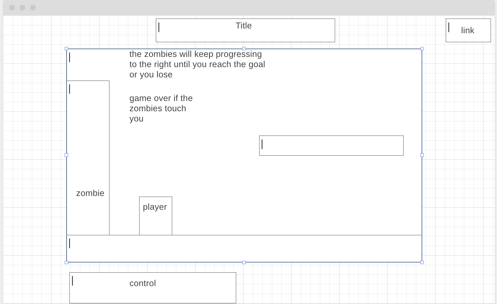

<h1><a href="https://kevlin2358.github.io/ZombieRunner/"> ZombieRunner </a></h1>

<p>Table of Contents</p>
<ul>
    <a href="#background"><li>Background</li></a>
    <a href="#functionality"><li>Functionality & MVPs</li></a>
    <a href="#technologies"><li>Technologies, Libraries, APIs</li></a>
    <a href="#code-snippet"><li>Code Snippet</li></a>
    <a href="#timeline"><li>Implementation Timeline</li></a>
</ul>

<h2 id="background">Background</h2>

This is a 2D platformer where the player trying to rack up points while avoiding zombies. The player will get to move and jump to avoid zombies while also trying to get items.
<ol>
    <li> If the player touches the zombie, the player will lose.</li>
    <li> The zombie horde will be constantly moving around.</li>
</ol>

<h2 id="functionality">Functionality & MVPs</h2>
<ul>
    <li>Players are able to control the character with A, D and spacebar</li>
    <li>Players are able to collect items to increase score / multiplier</li>
    <li>Players must avoid touching the zombies</li>
    <li>Zombies movement speed will increase over time, making your run much more difficult.</li>
    <br>
</ul>
<!--  -->

<ul>
    <span>In addition, this project will include:</span>
    <li>A production README</li>
    <li>Nav links to the project's Github repo, and others.</li>
    <li>Game Controls used will be shown</li>
</ul>

<h2 id="technologies">Technologies, Libraries, APIs</h2>
<ul>
    <li>Canvas API to render the game</li>
    <li>Webpack to bundle and transpile the source JavaScript code</li>
    <li>Assets:</li>
    <ul>
        <li>Zombie sprite asset from: 
            <a href='https://www.vhv.rs/viewpic/bxwRi_pixel-zombie-sprite-sheet-hd-png-download'>link</a>
        </li>
        <li>Item sprite asset from Emma Mrou: 
            <a href='https://www.pinterest.fr/pin/446560119286334934/'>link</a>
        </li>
        <li>Character sprite: 
            <a href='https://www.deviantart.com/demontomat0/art/Survivor-Sprites-WIP-213137373'>link</a>
        </li>
        <li>Music from: Chase by Alexander Nakarada |  <a href='https://www.serpentsoundstudios.com'>link</a></li>
        <li>Music promoted by <a href='https://www.free-stock-music.com'>link</a></li>
        <li>Attribution 4.0 International (CC BY 4.0)<a href='https://creativecommons.org/licenses/by/4.0/'>link</a></li>
    </ul>
</ul>
<h2 id="code-snippet">Code Snippet</h2>
    <p>
    ```
        randomizePower(){
        let ranNum = Math.floor(Math.random() * (this.items.length));
        this.randomItem = this.items[ranNum];
        this.name = this.randomItem.name;
        this.itemX = this.randomItem.x;
        this.itemY = this.randomItem.y;
    }
    randomizeSpawn(){
        let xh = xWidth;
        let yh = yHeight;
        let ranX = Math.floor(Math.random() * (xh.length));
        let ranY = Math.floor(Math.random() * (yh.length));
        this.x = xh[ranX]
        this.y = yh[ranY];
    }

    drawItem(ctx){
        ctx.drawImage(this.itemImg, 
            this.itemX, this.itemY, this.imageWidth, this.imageHeight, 
            this.x, this.y, this.width, this.height);
    }
    ```
    </p>
    <p>Randomizing items spawn position, item sprite and effects.</p>
    <p>Every time the player collects an item, the item will respawn.</p>
<h2 id="timeline">Implementation Timeline</h2>
<ul>
    <h3>Friday Afternoon and Weekend: </h3>
    <li>Get the canvas up and running. Start getting the game logic in place for character movement and zombie movement.</li>
    <h3>Monday: </h3>
    <li>Make sure all the core gameplay is setup and running with no errors. If everything is good, I will be able to start styling the webpage to make it look clean.</li>
    <h3>Tuesday: </h3>
    <li>Get the character models, background canvas, platform image ready. </li>
    <h3>Wednesday: </h3>
    <li>If I finished styling the game, I can start implementing power ups to make the gameplay more fun.</li>
    <h3>Thursday Morning:</h3>
    <li>Deploy to Github pages.</li>
</ul>

